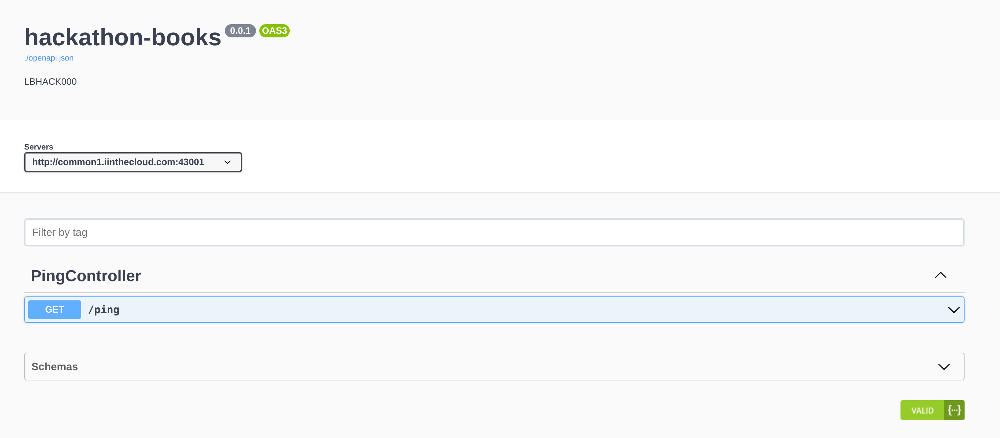
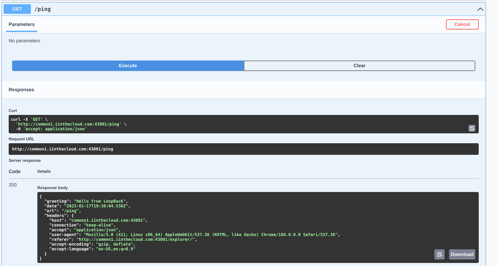

# Creating our LoopBack Application with the `lb4` CLI

We are now logged onto our systems through an SSH session, and we have played aroud in Bash a little to understand why this is the environment where we should be developing open-source software. It is now time to go ahead and start developing our LoopBack application!

_I have gone ahead and downloaded both Node.js and then used `npm` to install `@loopback/cli` globally on the system. To do these tasks requires `*ALLOBJ` authority, so your hackathon accounts wouldn't have access. If following these steps on your own system, just know there are some additional things you will need._

## Using the CLI

As I demonstrated yesterday, using the LoopBack CLI is incredibly easy. One of the main goals of the LoopBack framework is to remove all of the hassle of setting up the underlying REST API scaffolding, and focus solely on your businesses' application logic.

To begin creating all of the files your LoopBack application needs, first ensure that you are in your user profile's home directory. We can do this by using the `cd` command that changes the current directory, and the `~` shortcut that tells the shell we want to go to our home directory.

```bash
cd ~
```

Now if we run `pwd` with Bash, we should see that we are located at `/home/<youruserid>`:

```bash
pwd
/home/username
```

Now that we know we are in our home directory, let's use the CLI to create our LoopBack application, which will also create a directory for that application's files. Simply run:

```bash
lb4 app
```

The CLI will then start up, and walk you through the information that it needs to create the application. The questions it asks (and the answers you should give) are as follows:

```
? Project name: (default)
```
This is the name of your REST API, and can be anything you would like (without spaces). This value is used in the `package.json` file that is generated as the name of your application, so must be a valud NPM package name (no spaces, dashes are ok). It will also use this value as the default directory name where your LoopBack code will reside. It will also use this to come up with a sensible value for your TypeScript classes that form the backbone of your application. I would name it something like `hackathon-books`. After you enter your name, press Enter.

```
? Project description: (default)
```
For now press Enter to accept the default.

```
? Project root directory: (default)
```
This is where you actually get to specify what you want your root directory to be named. If you gave your application a decent and sensible name, then the default will probably be adequate. If it is trying to give you something that doesn't seem like a good directory name (I personally am not a fan of capitals in my directory names), feel free to change it. Otherwise, just press Enter.

```
? Application class name: (default)
```
The name of the TypeScript class that runs the entire application. This isn't something we usually invoke ourselves (we let the CLI do the work), but it is a good idea to name it according to TypeScript conventions (PascalCase, not camelCase or snake_case). If you entered `hackathon-books` for your Project Name, it suggests `HackathonBooksApplication`, which seems sensible to me.

```
? Select features to enable in the project (Press <space> to select, <a> to toggle all, <i> to invert selection, and <enter> to proceed)
...
...
...
```
This is the most involved part of the LoopBack application creation process. What you are presented with is a list of features that you can enable/disable for your LoopBack project. You are actually given a menu that you can navigate around with the up and down arrow keys, and can change your selection for any feature with the Space Bar. A selected feature will have a green circle, an unselected feature will have an empty circle.

These features will download additional code onto the system to do some sort of additional work for us (keeping our code pretty, running tests, creating a Dockerfile, etc.). They are all enabled be default, and you can just accept them all without any worry, but I would recommend **UNSELECTING** the following options:

* `Enable eslint`
* `Enable prettier`
* `Enable mocha`
* `Enable docker`

For this hackathon, we don't really care if our code conforms to rules we have specified, and we aren't going to be running tests, so we can get rid of the first three. And Docker doesn't even run on IBM i, so we can get rid of the Docker feature. All of the other options are things that could at least be sometwhat useful for us, so lets keep them. Once you have made your selections, hit Enter.

You will be presented with a long list of files that it creates in the directory you specified, then it will download the third-party packages it needs from NPM. Remember, these packages are the dependencies that LoopBack requires to run, as well as those packages dependencies, and so on.

It finishes with a note that:

```
Application hackathon-books was created in hackathon-books.

Next steps:

$ cd hackathon-books
$ npm start
```

Let's do just that! Navigate to the newly created directory:

```
cd hackathon-books
```

Before we run our application, we need to keep in mind that *we are all sharing the same system! By default, LoopBack serves itself up on port 3000. If you all were to run `npm start`, the first one who ran it would be able to serve up their LoopBack application, but the rest of you would get an error that the port is already in use!

To set the port that we want LoopBack to run on, we can preface our call by setting the environment variable `PORT` to `43XXX`, where `XXX` is the number of your workshop profile. We have to prefix with 43, because only the ports in the 43XXX to 50000 range are open on this system. So if you are using profile `LBHACK012`, you would run:

```
PORT=43012 npm start
```

You will get some output that the application is building (remember, our application is written with TypeScript, which needs to be _transpiled_ to JavaScript before it can be run in the Node.js runtime), and finally it will notify you that:

```
Server is running at http://[::1]:43XXX
Try http://[::1]:43XXX/ping
```

Where again, XX is the numbers at the end of your user profile. LoopBack isn't aware of what your system is called on the external network, so you will have to replace the ::1 with the name of our system. In our case, our URLs will look like `http://systemname:430XX/ping`.

When you navigate in your browser to that endpoint (`/ping` is a `GET` endpoint that we are provided for free), you are presented with  some raw JSON output. When putting this hackathon together, this is what I got (I added newlines and indentation to make it easier to read):

```json
{
  "greeting":"Hello from LoopBack",
  "date":"2023-01-17T18:08:26.525Z",
  "url":"/ping",
  "headers":
  {
    "host":"localhost:43001",
    "connection":"keep-alive",
    "sec-ch-ua":"\"Google Chrome\";v=\"105\", \"Not)A;Brand\";v=\"8\", \"Chromium\";v=\"105\"",
    "sec-ch-ua-mobile":"?0",
    "sec-ch-ua-platform":"\"Linux\"",
    "upgrade-insecure-requests":"1",
    "user-agent":"Mozilla/5.0 (X11; Linux x86_64) AppleWebKit/537.36 (KHTML, like Gecko) Chrome/105.0.0.0 Safari/537.36",
    "accept":"text/html,application/xhtml+xml,application/xml;q=0.9,image/avif,image/webp,image/apng,*/*;q=0.8,application/signed-exchange;v=b3;q=0.9",
    "sec-fetch-site":"none",
    "sec-fetch-mode":"navigate",
    "sec-fetch-user":"?1",
    "sec-fetch-dest":"document",
    "accept-encoding":"gzip, deflate, br",
    "accept-language":"en-US,en;q=0.9"
    }
  }
```

Neat! Except that's not really that flashy, since it is just a bunch of information about my browswer and when I pinged the server. It also is formatted in a way that a computer would be able to parse it, not something interesting for our eyes.

However, when we started our server, we also started the API explorer that allows us to visually poke around and see (and test) our API endpoints. To go there, simply navigate in your browser to `oursystem:3XXX/explorer`. When you get there, you should see a neat little REST API visualizer (called SwaggerUI) that allows you to visually see everything LoopBack has running.



If you open up the `/ping` endpoint under the PingController, you should be able to see more information about our one endpoint. By default it will show you what type of information is returned with a 200 HTTP status code (that's the good one, meaning everything worked as expected). If we click "Try it out" in the upper right, we can send a request to that endpoint and see what we get in return. Hit "Execute" and see what happens!



It should look similar, because it is the same JSON (with an updated datetime) that we got from our browser! In fact, you can call the endpoint through any program that can make HTTP calls, and should receive the same JSON payload.

For now, we are done using our LoopBack application. You can shut it down by pressing Ctrl + C on your keyboard while in your terminal.

So far, we've not only created out first REST API endpoint, but we have seen how we can explore it visually in our browser and interact with it programatically. However, you want your REST APIs to do something more interesting than just return ping information: You want them to run the data management aspects of your business! Let's continue, and look at how we can create a data source for connecting to our data store (the Db2 for i database at the heart of IBM i).

---
Next: [Setting up our DataSource](e.loopback-datasource.md)