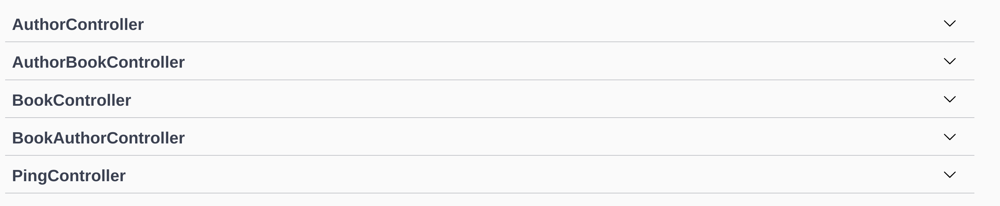

# Creating Relations with the `lb4` CLI

https://loopback.io/doc/en/lb4/Relations.html

Recall that we had defined a few relationships between our Models that we needed to implement:

1. **`Books`** has many **`Authors`**
2. **`Authors`** has many **`Books`**

With our Models, Repositories, and Controllers all defined, we can now define these relationships. The relationships we create not only define how our data relates to one another, but it also affects the behavior of the endpoints that are created for our REST API.

As you might expect, we are going to create the relations with the `lb4` CLI. The only tricky part is understanding some of the terminology. The CLI will ask you for a `source ID` and a `target ID`. In our above list of relations for our data model, the `source` is the left column, and the `target` is the right column. In fact, lets rewrite that column using LoopBack terminology:

1. **`Books`** hasManyThrough **`Authors`**
2. **`Authors`** hasManyThrough **`Books`**

These are the relations we want to define. Lets run the CLI and walk through the output!

```
lb4 relation
```

The `hasManyThrough` type of relation indicates that there may be multiple source models on the target, and there may be multiple target models on the sources. To implement these relations, we created some intermediate or through models that track the foreign keys of both.

1. **`Books`** hasManyThrough **`Authors`** -> **`AuthorsBooks`** through model
2. **`Authors`** hasManyThrough **`Books`** -> **`AuthorsBooks`** through model

Note that both relations can share a through model, since they are recording the same information just in different directions.

For each of these relations, call the CLI and walk through the steps, making your output look like the following:

```
? Please select the relation type hasManyThrough
? Please select source model Book
? Please select target model Author
? Please select through model AuthorsBooks
? Foreign key name that references the source model to define on the through model bookId
? Foreign key name that references the target model to define on the through model authorId
? Source property name for the relation getter (will be the relation name) authors
? Allow Book queries to include data from related Author instances?  Yes
   create src/controllers/book-author.controller.ts

No change to package.json was detected. No package manager install will be executed.

Relation HasManyThrough was/were created in src
```

```
? Please select the relation type hasManyThrough
? Please select source model Author
? Please select target model Book
? Please select through model AuthorsBooks
? Foreign key name that references the source model to define on the through model authorId
? Foreign key name that references the target model to define on the through model bookId
? Source property name for the relation getter (will be the relation name) books
? Allow Author queries to include data from related Book instances?  Yes
   create src/controllers/author-book.controller.ts

No change to package.json was detected. No package manager install will be executed.

Relation HasManyThrough was/were created in src
```

These `hasManyThrough` relations allow us to do the following: Given a **`Book`**, retrieve all of its **`Authors`**; Given an **`Author`**, retrieve all of their **`Books`**.

And with those relations defined, our work defining our data should be completely **FINISHED!**. If you restart your LoopBack application, you should now see that you have all sorts of Controllers exposing endpoints that allow us to get all of the information we need to run the inventory for Hackathon Books.



Now, its finally time to take the entire data model we have been defining for the last several sections, and create databse tables for everything!

---
Next: [Migrating our Models](j.loopback-migration.md)